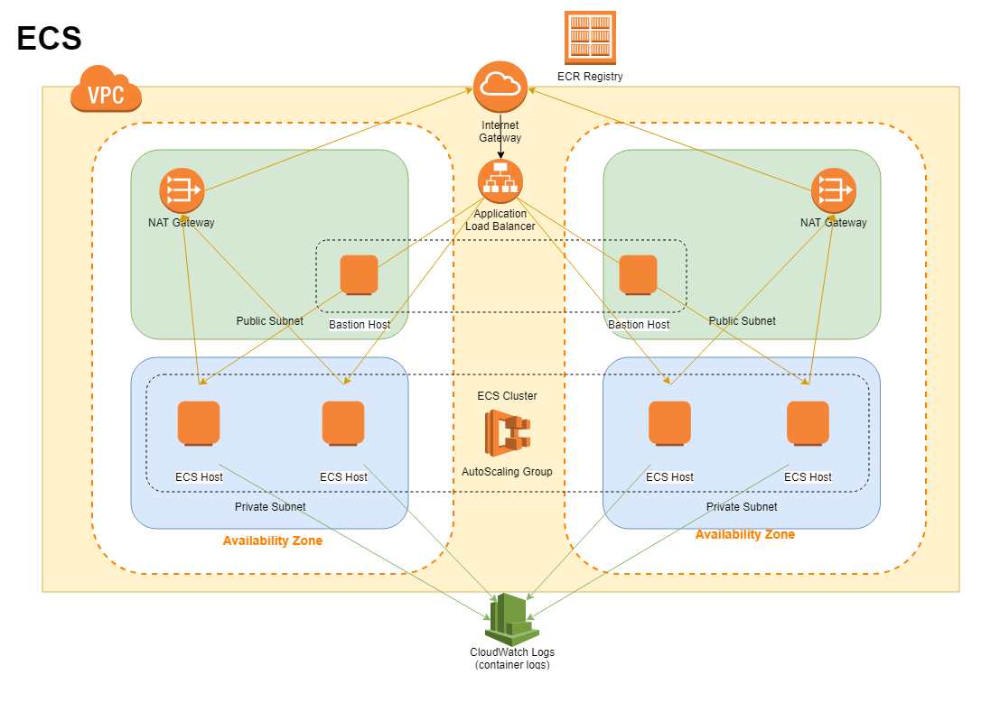

# Elastic Container Service (ECS)

Table of Contents
- [Example of ECS with Application Load Balancer](#example-of-ecs-with-application-load-balancer)
- [Target Tracking Scaling option with predefined metrics](#target-tracking-scaling-option-with-predefined-metrics)
- [Target Tracking Scaling option with custom metrics `CPUUtilization` and `MemoryUtilization` (Maximum)](#target-tracking-scaling-option-with-custom-metrics-cpuutilization-and-memoryutilization-maximum)
- [Step Scaling option with Custom metic `CPUUtilization` and `MemoryUtilization` (Maximum)](#step-scaling-option-with-custom-metic-cpuutilization-and-memoryutilization-maximum)
- [Amazon ECS-optimized AMI](#amazon-ecs-optimized-ami)
- [Migrating from Amazon Linux to Amazon Linux 2 for ECS](#migrating-from-amazon-linux-to-amazon-linux-2-for-ecs)
- [Subscribing to Amazon ECS-Optimized Amazon Linux AMI Update Notifications](
    https://docs.aws.amazon.com/AmazonECS/latest/developerguide/ECS-AMI-SubscribeTopic.html)
- [Retrieving Amazon ECS-Optimized AMI Metadata](
    https://docs.aws.amazon.com/AmazonECS/latest/developerguide/retrieve-ecs-optimized_AMI.html)

---

## Example of ECS with Application Load Balancer




## Auto Scaling on EC2 Cluster

### Target Tracking Scaling option with predefined metrics
  See [predefined metric](
  https://docs.aws.amazon.com/autoscaling/ec2/APIReference/API_PredefinedMetricSpecification.html)
  `ASGAverageCPUUtilization` for EC2 Cluster

- Probably not reactive enough if using Average for traffic that does not have a pattern; could be a huge difference
  between Max and Average.

    ```
    "TargetTrackingScalingPolicy": {
      "Type": "AWS::AutoScaling::ScalingPolicy",
      "Properties": {
        "AutoScalingGroupName": {"Ref": "ECSAutoScalingGroup"},
        "PolicyType": "TargetTrackingScaling",
        "TargetTrackingConfiguration": {
          "DisableScaleIn": false,
          "PredefinedMetricSpecification": {
            "PredefinedMetricType": "ASGAverageCPUUtilization"
          },
          "TargetValue": {"Ref": "ClusterAutoScalingGroupAverageCPUUtilization"}
        }
      }
    },
    ```

### Target Tracking Scaling option with custom metrics `CPUUtilization` and `MemoryUtilization` (Maximum) 

- Waited for 5+ minutes to start a new EC2.
- See as Error not only when it is above the desired utilization but also below the desired utilization.
- Also a TargetTrackingAcaling policy does not scale your Auto Scaling group when the specified metric has
  insufficient data. It does not scale in your Auto Scaling group because it does not interpret insufficient data as
  low utilization.
- To scale in your Auto Scaling group when the specified metric has insufficient data, create a simple or step
  scaling policy and have an alarm invoke the scaling policy when it changes to the INSUFFICIENT_DATA state.

- E.g. On CPUUtilization

    ```
    "TargetTrackingScalingPolicyOnCPUUtilization": {
      "Type": "AWS::AutoScaling::ScalingPolicy",
      "Properties": {
        "AutoScalingGroupName": {"Ref": "ECSAutoScalingGroup"},
        "PolicyType": "TargetTrackingScaling",
        "TargetTrackingConfiguration": {
          "CustomizedMetricSpecification": {
            "Dimensions": [{
              "Name": "ClusterName",
              "Value":  {"Fn::Join": ["-", [{"Fn::FindInMap": ["StageMap", {"Ref":"Stage"}, "EnvironmentName"]}, "Cluster"]]}
            }],
            "MetricName": "CPUUtilization",
            "Namespace": "AWS/ECS",
            "Statistic": "Maximum",
            "Unit": "Percent"
          },
          "DisableScaleIn": false,
          "TargetValue": {"Ref": "ClusterAutoScalingGroupTargetCPUUtilization"}
        }
      }
    },
    ```

### Step Scaling option with Custom metic `CPUUtilization` and `MemoryUtilization` (Maximum) 

- Need (at least) two Alarms for scale-out and scale-in. 
- Scale-in alarm (if cpu < 30%) will be alerted as "Error" (similar as that of TargetTrackingScaling).
- Responsive to spikes with "Maximum" when scale-out and "Average" when scale-in.
- E.g. On `CPUUtilization`

    ```
    "StepScalingScaleOutPolicyOnCPUUtilization": {
      "Type": "AWS::AutoScaling::ScalingPolicy",
      "Properties": {
        "AdjustmentType": "ChangeInCapacity",
        "AutoScalingGroupName": {"Ref": "ECSAutoScalingGroup"},
        "EstimatedInstanceWarmup": 300,
        "MetricAggregationType": "Maximum",
        "PolicyType": "StepScaling",
        "StepAdjustments": [{
          "MetricIntervalLowerBound": 0,
          "ScalingAdjustment": 1
        }]
      }
    },
    "StepScalingScaleOutPolicyOnMemoryUtilization": {
      "Type": "AWS::AutoScaling::ScalingPolicy",
      "Properties": {
        "AdjustmentType": "ChangeInCapacity",
        "AutoScalingGroupName": {"Ref": "ECSAutoScalingGroup"},
        "EstimatedInstanceWarmup": 300,
        "MetricAggregationType": "Maximum",
        "PolicyType": "StepScaling",
        "StepAdjustments": [{
          "MetricIntervalLowerBound": 0,
          "ScalingAdjustment": 1
        }]
      }
    },
    "StepScalingScaleInPolicyOnCPUUtilization": {
      "Type": "AWS::AutoScaling::ScalingPolicy",
      "Properties": {
        "AdjustmentType": "ChangeInCapacity",
        "AutoScalingGroupName": {"Ref": "ECSAutoScalingGroup"},
        "MetricAggregationType": "Average",
        "PolicyType": "StepScaling",
        "StepAdjustments": [{
          "MetricIntervalUpperBound": 0,
          "ScalingAdjustment": -1
        }]
      }
    },

    "AutoScalingHighEcsCpuAlarm": {
      "Type": "AWS::CloudWatch::Alarm",
      "Properties": {
        "AlarmActions": [
          {"Ref": "StepScalingScaleOutPolicyOnCPUUtilization"},
          {"Ref": "SnsNotificationTopic"}
        ],
        "AlarmDescription": {"Fn::Join": [" ",
          ["Containers CPU Utilization High", {"Ref": "ClusterAutoScalingHighCPUValue"}]
        ]},
        "AlarmName": {"Fn::Join": ["/", [{"Ref": "ECSCluster"}, "CPUUtilizationHigh"]]},
        "ComparisonOperator": "GreaterThanOrEqualToThreshold",
        "Dimensions": [{
           "Name": "ClusterName",
           "Value": {"Ref": "ECSCluster"}
         }],
        "EvaluationPeriods": 1,
        "MetricName": "CPUUtilization",
        "Namespace": "AWS/ECS",
        "Period": 60,
        "Statistic": "Maximum",
        "Threshold": {"Ref": "ClusterAutoScalingHighCPUValue"},
        "TreatMissingData": "notBreaching"
      }
    },
    "AutoScalingHighEcsMemoryAlarm": {
      "Type": "AWS::CloudWatch::Alarm",
      "Properties": {
        "AlarmActions": [
          {"Ref": "StepScalingScaleOutPolicyOnMemoryUtilization"},
          {"Ref": "SnsNotificationTopic"}
        ],
        "AlarmDescription": {"Fn::Join": [" ",
          ["Containers Memory Utilization High", {"Ref": "ClusterAutoScalingHighMemoryValue"}]
        ]},
        "AlarmName": {"Fn::Join": ["/", [{"Ref": "ECSCluster"}, "MemoryUtilizationHigh"]]},
        "ComparisonOperator": "GreaterThanOrEqualToThreshold",
        "Dimensions": [{
           "Name": "ClusterName",
           "Value": {"Ref": "ECSCluster"}
         }],
        "EvaluationPeriods": 1,
        "MetricName": "MemoryUtilization",
        "Namespace": "AWS/ECS",
        "Period": 60,
        "Statistic": "Maximum",
        "Threshold": {"Ref": "ClusterAutoScalingHighMemoryValue"},
        "TreatMissingData": "notBreaching"
      }
    },
    "AutoScalingLowEcsCpuAlarm": {
      "Type": "AWS::CloudWatch::Alarm",
      "Properties": {
        "AlarmActions": [
          {"Ref": "StepScalingScaleInPolicyOnCPUUtilization"}
        ],
        "AlarmDescription": {"Fn::Join": [" ",
          ["Containers CPU Utilization Low", {"Ref": "ClusterAutoScalingLowCPUValue"}]
        ]},
        "AlarmName": {"Fn::Join": ["/", [{"Ref": "ECSCluster"}, "CPUUtilizationLow"]]},
        "ComparisonOperator": "LessThanOrEqualToThreshold",
        "Dimensions": [{
           "Name": "ClusterName",
           "Value": {"Ref": "ECSCluster"}
         }],
        "EvaluationPeriods": 1,
        "MetricName": "CPUUtilization",
        "Namespace": "AWS/ECS",
        "Period": 600,
        "Statistic": "Average",
        "Threshold": {"Ref": "ClusterAutoScalingLowCPUValue"},
        "TreatMissingData": "notBreaching"
      }
    },
    ```

## Amazon ECS-optimized AMI

- **Amazon Linux 2 AMI** 
  - By default, the Amazon ECS-optimized Amazon Linux 2 AMI ships with a single 30-GiB root volume. You can modify
    the 30-GiB root volume size at launch time to increase the available storage on your container instance.
    This storage is used for the operating system and for Docker images and metadata.
  - The default filesystem for the Amazon ECS-optimized Amazon Linux 2 AMI is ext4, and Docker uses the overlay2
    storage driver.

- **Amazon Linux (1) AMI** 
  - Amazon ECS-optimized Amazon Linux AMIs from version 2015.09.d and later launch with an 8-GiB volume for the
    operating system that is attached at /dev/xvda and mounted as the root of the file system.
  - There is an additional 22-GiB volume that is attached at /dev/xvdcz that Docker uses for image and metadata storage. 


## Migrating from Amazon Linux to Amazon Linux 2 for ECS

See also [Migrating to Amazon Linux 2](https://cloudonaut.io/migrating-to-amazon-linux-2/)

In CloudFormation
  
- Add `Parameters` for always using the latest AMI

    ```
    "EcsOptimizedAmi": {
      "Description": "Amazon ECS-optimized AMI",
      "Type": "AWS::SSM::Parameter::Value<AWS::EC2::Image::Id>",
      "Default": "/aws/service/ecs/optimized-ami/amazon-linux-2/recommended/image_id"
    },
    ```    

- In `BlockDeviceMappings`, use `/dev/xvda` instead of `xvdcz`

    ```
    "BlockDeviceMappings": [{
      "DeviceName": "/dev/xvda",
      "Ebs": {
        "VolumeType": "gp2",
        "VolumeSize": {"Ref": "EcsInstanceVolumeSize"}
      }
    }],
    ```

- In `AWS::CloudFormation::Init`, use `awslogsd` instead of `awslogs`

    ```
    "services": {
      "sysvinit": {
        "cfn-hup": {
          "enabled": true,
          "ensureRunning": true,
          "files": [
            "/etc/cfn/cfn-hup.conf",
            "/etc/cfn/hooks.d/cfn-auto-reloader.conf"
          ]
        },
        "awslogsd": {
          "enabled": true,
          "ensureRunning": true,
          "files": [
            "/etc/awslogs/awslogs.conf",
            "/etc/awslogs/awscli.conf"
          ]
        }
      }
    }
    ```